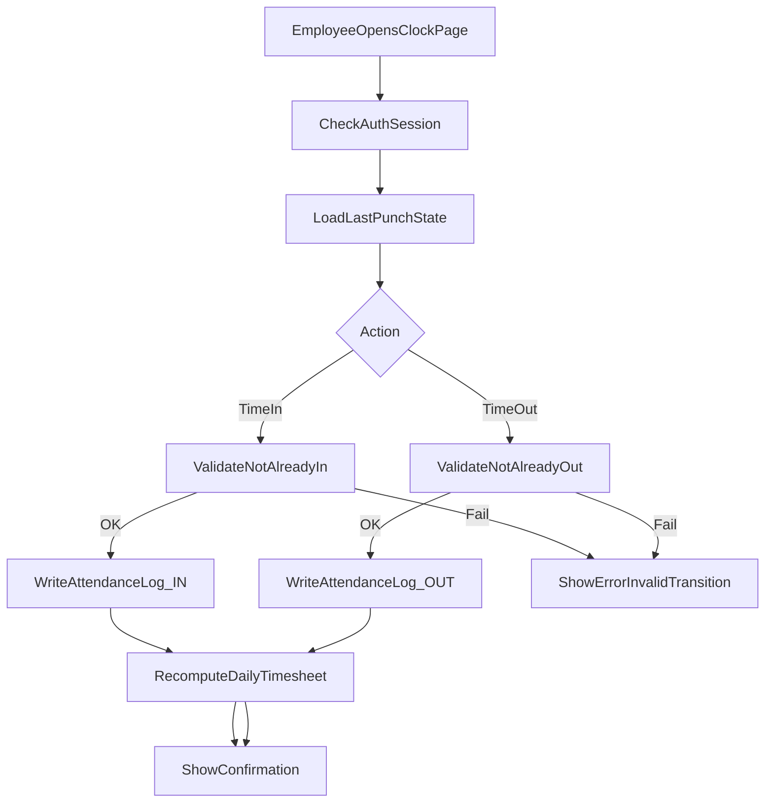
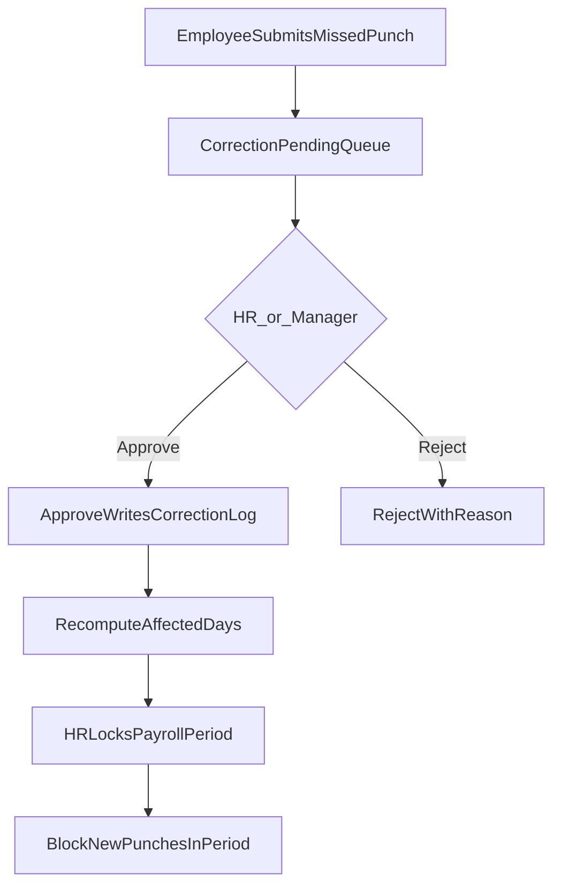
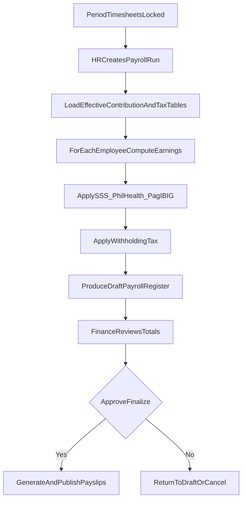
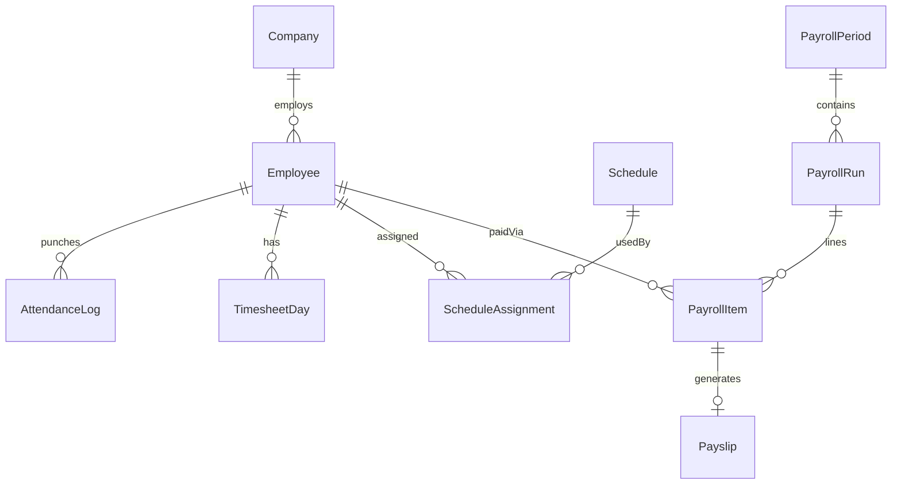

# Product Requirements Document: Philippines Payroll System

| Field | Value |
| --- | --- |
| Product | Philippines Payroll + Timekeeping Platform |
| Version | 1.0 |
| Status | Draft |
| Jurisdiction | Republic of the Philippines |
| Last updated | 2026-08-03 |

---

## 1. Overview

### 1.1 Problem

Philippine employers need a reliable way to capture employee Time In / Time Out, convert attendance into payable hours (including late, undertime, overtime, and holiday premiums), and run payroll with statutory deductions (SSS, PhilHealth, Pag-IBIG, BIR withholding tax). Spreadsheets and disconnected time clocks create errors, weak audit trails, and delayed payslips.

### 1.2 Product vision

A web-first payroll and timekeeping platform for Philippine companies: employees clock in/out; HR/payroll admins run cut-off periods; the system computes gross → statutory contributions → withholding tax → net; employees receive transparent payslips. Phase 2 expands into full HRIS (leave, shifts, org structure, government filings, bank disbursement).

### 1.3 Goals

- Accurate Time In / Time Out capture with Asia/Manila day boundaries.
- Deterministic payroll calculation from attendance, schedules, and rate configuration.
- Philippines statutory deductions and withholding tax using versioned, effectivity-dated tables.
- Role-based access and full audit trail for attendance edits and payroll runs.
- Clear path from MVP (Phase 1) to HRIS + filings (Phase 2).

### 1.4 Non-goals (v1)

- Biometric hardware / kiosk SDKs (future).
- Native mobile apps (web responsive is sufficient for Phase 1).
- Multi-country payroll or multi-tenant SaaS isolation (single-company first).
- Legal certification of tax tables (system stores configurable tables; rates must be verified against current circulars).
- Full accounting GL / ERP replacement.

### 1.5 Success metrics

| Metric | Target (Phase 1) |
| --- | --- |
| Clock-in success rate | ≥ 99% of attempts succeed within 2s (p95) |
| Payroll run completion | Cut-off → draft payslips in &lt; 5 minutes for ≤ 500 employees |
| Payslip availability | 100% of paid employees can view payslip within 1 hour of payroll finalize |
| Attendance correction turnaround | HR resolves missed-punch requests within same cut-off when submitted ≥ 24h before lock |
| Calculation disputes | &lt; 2% of payslips require post-finalize correction due to system error |

---

## 2. Personas and roles

| Role | Primary needs |
| --- | --- |
| **Employee** | Time In / Time Out; view own attendance & timesheet; request corrections; view payslips |
| **Team Lead / Manager** | View team attendance exceptions; approve corrections (Phase 1 optional; Phase 2 required); approve leave (Phase 2) |
| **HR / Payroll Admin** | Employee master; schedules; adjust timesheets; configure contribution/tax tables; run payroll; publish payslips |
| **Finance / Approver** | Review payroll summary; approve finalize; export bank file (Phase 2) |
| **System Admin** | Users, roles, company settings, audit access, holiday calendar |

### 2.1 Permission summary

| Capability | Employee | Manager | HR/Payroll | Finance | Admin |
| --- | --- | --- | --- | --- | --- |
| Own Time In/Out | ✓ | ✓ | ✓ | ✓ | ✓ |
| View own payslip | ✓ | ✓ | ✓ | ✓ | ✓ |
| View team attendance | — | ✓ | ✓ | — | ✓ |
| Edit any timesheet | — | — | ✓ | — | ✓ |
| Configure tax/contribution tables | — | — | ✓ | — | ✓ |
| Run / finalize payroll | — | — | ✓ | Approve | ✓ |
| Manage users & roles | — | — | — | — | ✓ |

---

## 3. Philippines compliance baseline

> **Important:** Contribution rates, MSC/ceilings, PhilHealth percentages, Pag-IBIG rates, and BIR withholding tables change via circulars. The product must store **versioned tables with effectivity dates**. Seed data is illustrative; HR must verify against current SSS, PhilHealth, Pag-IBIG, and BIR issuances before production use.

### 3.1 Statutory contributions (employee + employer shares)

| Agency | Purpose | System behavior |
| --- | --- | --- |
| **SSS** | Social Security | Lookup contribution based on monthly salary credit / compensation bracket; split EE/ER; support effectivity-dated schedule |
| **PhilHealth** | Health insurance | Compute from premium rate × basis (subject to floor/ceiling if configured); split EE/ER |
| **Pag-IBIG (HDMF)** | Housing fund | Percent of monthly compensation with configurable min/max; split EE/ER |
| **BIR withholding tax** | Income tax | Withhold on taxable compensation using configured withholding tax table (TRAIN/CREATE era brackets as admin-maintained data) |

### 3.2 Compensation and premiums (Labor Code–oriented)

Configurable rules (defaults aligned with common PH practice):

| Rule | Default expectation |
| --- | --- |
| Regular OT | Premium on hourly rate beyond scheduled hours (e.g. +25% ordinary day) |
| Rest day work | Higher premium; OT on rest day stacked per policy tables |
| Special non-working holiday | Premium per company/holiday type config |
| Regular holiday | Premium (e.g. 200% if worked) per config |
| Night differential | Premium for hours in night window (e.g. 10:00 PM–6:00 AM), typically +10% |
| Late / undertime | Deduct from payable hours or daily rate equivalent |
| Grace period | Minutes after shift start before late applies |
| 13th month pay | Accrue / compute annually (Phase 1: report + manual run; Phase 2: automated accrual) |

### 3.3 Holiday calendar

- Company maintains a holiday calendar (legal, special non-working, company).
- Attendance and payroll engines resolve day type in **Asia/Manila**.

### 3.4 Cut-off and pay frequency

- Support semi-monthly (e.g. 1–15 / 16–EOM) and monthly cut-offs.
- Payroll period has states: `Open` → `Locked` (timesheet freeze) → `DraftPayroll` → `Approved` → `Finalized` → `Paid` (Phase 2 bank export).

### 3.5 Compliance disclaimer

The system is a calculation and records tool. It does not replace advice from a licensed accountant, tax practitioner, or labor counsel. Filing formats in Phase 2 are **template-based exports** and must be validated against current agency specs.

---

## 4. Phase 1 requirements (MVP) — Time In/Out + Payroll

Phase 1 delivers: auth/roles, employee master, schedules, Time In/Out, timesheets, payroll calculation, statutory deductions, payslips, and basic reports.

### 4.1 Authentication and company setup

**User stories**

- As an Admin, I can invite users and assign roles so only authorized people access payroll data.
- As an Admin, I can set company name, TIN, SSS/PhilHealth/Pag-IBIG employer numbers, and default cut-off pattern.

**Acceptance criteria**

- [ ] Login required for all routes except public health check.
- [ ] Role checks enforced server-side for HR/Finance actions.
- [ ] Company profile stores employer registration numbers used on payslips.
- [ ] Session timeout and password/reset (or IdP) per chosen auth provider.

### 4.2 Employee master

**User stories**

- As HR, I can create/update an employee with employment and statutory IDs.
- As HR, I can set pay type (monthly / daily / hourly) and basic rate.

**Acceptance criteria**

- [ ] Required fields: employee number, full name, hire date, employment status (Active/Separated), pay type, basic rate (stored in centavos), department (optional in Phase 1).
- [ ] Statutory IDs: TIN, SSS number, PhilHealth number, Pag-IBIG number (nullable with warning on payroll if missing when contribution required).
- [ ] Bank account fields optional in Phase 1 (required in Phase 2 for disbursement export).
- [ ] Soft-delete / separate with effective end date; separated employees excluded from new Time In and open payroll periods after end date.
- [ ] Audit log on create/update of rate and statutory IDs.

### 4.3 Work schedules

**User stories**

- As HR, I can define a schedule (e.g. Mon–Fri 9:00–18:00 with 1h break) and assign it to employees.
- As HR, I can set grace minutes and whether OT requires pre-approval flag (informational in Phase 1).

**Acceptance criteria**

- [ ] Schedule includes workdays, start/end time, break minutes, rest days, grace period, night differential window reference.
- [ ] Employee has an effective-dated schedule assignment.
- [ ] Late = clock-in after (start + grace); undertime = clock-out before end (minus approved leave/break rules).
- [ ] Expected hours per day derived from schedule for OT detection.

### 4.4 Time In / Time Out

**User stories**

- As an Employee, I can Time In and Time Out from a mobile-friendly web page.
- As an Employee, I cannot Time In twice without Timing Out (and vice versa).
- As an Employee, I can request a missed-punch correction when I forget to clock.

**Acceptance criteria**

- [ ] Single prominent Clock In / Clock Out control showing current Manila date/time and last punch.
- [ ] System rejects invalid transitions (In while already In; Out while already Out).
- [ ] Each punch stores: employeeId, type (IN/OUT), server timestamp (UTC), Manila calendar date, optional client IP, optional geolocation if enabled in company settings.
- [ ] Geolocation/IP are **optional flags**; not required to clock in Phase 1.
- [ ] Missed-punch request: proposed time, reason, status Pending/Approved/Rejected; only HR (or Manager if enabled) can approve; approval writes an AttendanceLog with source=`Correction`.
- [ ] Employees see only their own punches; HR can view all.

### 4.5 Timesheets and period lock

**User stories**

- As HR, I can view a period timesheet summarizing daily hours, late, undertime, OT per employee.
- As HR, I can manually adjust daily hours with a reason before lock.
- As HR, I can lock a period so employees cannot alter punches for that cut-off.

**Acceptance criteria**

- [ ] Daily summary recomputed from punch pairs within Manila day (handle overnight shifts spanning midnight).
- [ ] Unpaired punches flagged as exceptions.
- [ ] Manual adjustment requires reason and is audited; does not delete original punches.
- [ ] Lock prevents new punches and corrections for dates in the period (Admin override with audit).
- [ ] Manager can view team exceptions list (missing Out, late beyond threshold).

### 4.6 Payroll run

**User stories**

- As HR, I can create a payroll run for a period and compute earnings and deductions for all active employees.
- As Finance, I can review totals and approve finalize.
- As HR, I can publish payslips after finalize.

**Acceptance criteria**

- [ ] Payroll engine inputs: locked timesheet hours, rate, day-type premiums, contribution tables effective on period end (or pay date—company setting), withholding table.
- [ ] Computation order documented: Regular pay → premiums (OT, holiday, ND) → other taxable earnings → non-taxable earnings → gross → EE contributions → taxable compensation → withholding tax → other deductions → net pay.
- [ ] Employer shares computed and stored for reporting (not deducted from net).
- [ ] Draft run is idempotent recalculation until finalized; finalize freezes line items.
- [ ] Re-open after finalize requires Admin + reason (creates new adjustment run in Phase 1 minimum viable: flag + manual note).
- [ ] Money stored/displayed as PHP with 2 decimal places; internal storage integer centavos.

### 4.7 Contribution and tax table admin

**User stories**

- As HR/Admin, I can upload or edit SSS/PhilHealth/Pag-IBIG/withholding tables with an effectivity start date.

**Acceptance criteria**

- [ ] Only one active version per table type per date (no overlapping ranges).
- [ ] Payroll run records which table version IDs were used.
- [ ] UI shows warning banner: “Verify rates against latest agency circulars.”

### 4.8 Payslips

**User stories**

- As an Employee, I can view and download my payslip for finalized periods.
- As HR, I can see a payslip preview before publish.

**Acceptance criteria**

- [ ] Payslip includes: company header, employee identity, period, earnings breakdown, EE deductions (SSS, PhilHealth, Pag-IBIG, tax, others), net pay, YTD optional in Phase 1.
- [ ] PDF download available after publish.
- [ ] Employees cannot see other employees’ payslips.

### 4.9 Basic reports (Phase 1)

- Attendance register by date range.
- Payroll register (gross, deductions, net) for a run.
- Contribution summary (EE/ER) per agency for a run.
- Exception report (missing punches, unapproved corrections).

---

## 5. Phase 2 requirements (HRIS expansion)

Phase 2 builds on Phase 1: leave, shifts, org structure, manager workflows, government exports, bank disbursement.

### 5.1 Leave management

**User stories**

- As HR, I can define leave types (VL, SL, EL, unpaid, etc.) with accrual rules.
- As an Employee, I can request leave against balance.
- As a Manager, I can approve/reject leave in my team.

**Acceptance criteria**

- [ ] Leave request has date range, type, status, approver chain.
- [ ] Approved leave reduces expected work hours / marks day as leave for attendance.
- [ ] Balances update on approve; cancel restores balance when policy allows.
- [ ] Conflict detection vs existing approved leave.

### 5.2 Shifts and rotating schedules

**User stories**

- As HR, I can define shift templates and rotating patterns (e.g. 4 days on / 2 off).
- As HR, I can assign shifts per employee per date.

**Acceptance criteria**

- [ ] Daily expected start/end can come from shift assignment overriding default schedule.
- [ ] Rest days configurable per rotation.
- [ ] OT/late/undertime use the assigned shift for that Manila date.

### 5.3 Organization structure

**User stories**

- As Admin, I can define org units, branches, and cost centers.
- As HR, I can assign employees to org unit and cost center.

**Acceptance criteria**

- [ ] Payroll and attendance reports filterable by branch / cost center.
- [ ] Manager scope limited to their org subtree.

### 5.4 Manager workflows and dashboards

- Team attendance board (present / late / absent / on leave).
- Exception queue (missed punches, OT claims).
- Leave approval inbox.
- Optional: OT pre-approval workflow before premium pays.

### 5.5 Government report exports

Template-driven CSV/Excel (and later fixed-width) exports, configurable to agency layouts:

| Export | Intent |
| --- | --- |
| SSS | Contribution collection / employee listing style exports (e.g. R3/R5-oriented templates) |
| PhilHealth | Premium remittance employee detail |
| Pag-IBIG | Membership / contribution remittance detail |
| BIR | 1601C-oriented summary and alphalist-oriented employee annualization extracts |

**Acceptance criteria**

- [ ] Export generated from finalized payroll data for selected period(s).
- [ ] Template version stored; HR can map columns without code deploy when possible.
- [ ] Download audited (who, when, which period).

### 5.6 Bank / payroll disbursement export

**User stories**

- As Finance, I can export a bank payroll file for net pays after finalize.

**Acceptance criteria**

- [ ] Employees have bank code, account number, account name validated for export.
- [ ] Export excludes zero/negative net with warning list.
- [ ] Supports at least one common PH bank/payroll file format template; additional banks via config.

### 5.7 13th month and richer compliance

- Automated 13th month accrual from basic earnings YTD.
- Night differential and holiday premium refinements tied to shift calendar.
- Expanded audit reports for DOLE-oriented inspection readiness (attendance + pay records retention).

---

## 6. Key flows

### 6.1 Time In / Time Out

### 6.2 Timesheet correction and lock

### 6.3 Payroll run

---

## 7. Data entities

Core entities (logical model; implement as PostgreSQL tables via Prisma):

| Entity | Key fields / notes |
| --- | --- |
| **Company** | name, TIN, employer SSS/PhilHealth/Pag-IBIG nos, cut-off config, clock geo/IP flags |
| **User** | auth identity, role, linked employeeId (nullable for pure admins) |
| **Employee** | employeeNo, name, hire/end dates, status, payType, basicRateCentavos, TIN, SSS, PhilHealth, Pag-IBIG, bank fields |
| **Schedule** | workdays, start/end, breakMinutes, graceMinutes, restDays |
| **ScheduleAssignment** | employeeId, scheduleId, effectiveFrom/To |
| **Holiday** | date, type (Legal/Special/Company), name |
| **AttendanceLog** | employeeId, punchType IN/OUT, punchedAtUtc, manilaDate, source (Clock/Correction), ip, geo, createdBy |
| **MissedPunchRequest** | proposedTime, reason, status, reviewerId |
| **TimesheetDay** | employeeId, manilaDate, regularMinutes, otMinutes, lateMinutes, undertimeMinutes, ndMinutes, dayType, adjustmentReason |
| **PayrollPeriod** | startDate, endDate, status, payDate |
| **PayrollRun** | periodId, status, tableVersionRefs, finalizedAt, finalizedBy |
| **PayrollItem** | runId, employeeId, earnings JSON/lines, deductions, erShares, gross, taxable, tax, net (centavos) |
| **ContributionTable** / **TaxTable** | type, effectiveFrom, effectiveTo, brackets JSON |
| **Payslip** | itemId, publishedAt, pdfStorageKey |
| **LeaveType** / **LeaveBalance** / **LeaveRequest** | Phase 2 |
| **Shift** / **ShiftAssignment** | Phase 2 |
| **OrgUnit** / **CostCenter** | Phase 2 |
| **AuditLog** | actorId, action, entityType, entityId, before/after, timestamp |

### 7.1 Relationships (high level)

---

## 8. UX principles

- **Clock first for employees:** One-screen Time In/Out; large tap targets; Manila time always visible.
- **Cut-off clarity:** Calendar and banners showing current period, lock date, and pay date.
- **Payslip transparency:** Line-item labels in plain language (e.g. “SSS (Employee)”, “Withholding Tax”).
- **Exception-driven HR:** Default HR home = unresolved missing punches + pending corrections + draft payroll status—not empty dashboards.
- **No card clutter on clock screen:** Brand/company name, status, single CTA.
- **Mobile-friendly web** for clock and payslip; desktop-oriented grids for payroll register.
- **Destructive actions** (finalize, lock, override) require confirm + reason.

---

## 9. Non-functional requirements

| Area | Requirement |
| --- | --- |
| **Timezone** | All labor-day logic in `Asia/Manila`; persist timestamps in UTC |
| **Money** | Integer centavos in DB; display PHP with 2 decimals; no IEEE float for pay math |
| **Security** | RBAC; encrypt secrets; TLS in transit; restrict PII/TIN to authorized roles; payslip authorization checks |
| **Audit** | Immutable audit trail for rate changes, punch corrections, period lock, payroll finalize |
| **Retention** | Retain attendance and payroll records per company policy (default ≥ 3 years configurable) |
| **Performance** | Clock punch p95 &lt; 2s; payroll 500 employees &lt; 5 minutes |
| **Availability** | Target 99.5% for clock endpoints during business hours |
| **Observability** | Sentry + structured logs; alert on payroll run failures |
| **Privacy** | Access logging for payslip/PDF downloads; minimize geo collection when disabled |

---

## 10. Assumptions and open questions

### 10.1 Assumptions

- Single company / single legal entity for Phase 1.
- Web Time In/Out is the primary capture method.
- Contribution and tax **algorithms** are productized; **rate values** are admin-maintained.
- Semi-monthly and monthly cut-offs cover initial customers.
- English UI first; Filipino labels optional later.

### 10.2 Open questions

- Should OT require pre-approval before it is payable in Phase 1, or only in Phase 2?
- Exact bank file formats to prioritize (BDO, BPI, Metrobank, UnionBank, etc.)?
- Is multi-branch cost allocation required before first customer go-live?
- Will employees use personal devices only, or shared floor tablets (affects auth UX)?
- Who is the source of truth for holiday proclamations each year (manual HR vs imported calendar)?

---

## 11. Release plan

| Phase | Scope | Outcome |
| --- | --- | --- |
| **Phase 1 — MVP** | Auth, employees, schedules, Time In/Out, timesheets, payroll calc, statutory tables, payslips, basic reports | Usable PH payroll with timekeeping |
| **Phase 2 — HRIS** | Leave, shifts, org structure, manager dashboards, government exports, bank export, 13th month automation | Full HRIS-style operations |
| **Future** | Biometrics, native mobile, multi-company/tenant, deeper BIR eFPS integrations | Scale and hardware |

---

## Appendix A — Technical approach (recommended)

Recommendation for implementation; teams may substitute equivalents if they preserve money/timezone/audit invariants.

| Layer | Choice | Rationale |
| --- | --- | --- |
| Frontend | **Next.js (App Router) + TypeScript + Tailwind** | Mobile-friendly clock UI, SSR for admin, single web codebase |
| Backend API | **Next.js Route Handlers / Server Actions** (Phase 1); extract NestJS/Fastify later only if needed | Fewer moving parts for MVP |
| Auth / RBAC | **Auth.js (NextAuth) or Clerk** + role claims | Session + role gates for payslips/PII |
| Database | **PostgreSQL** | Relational integrity for employees, attendance, payroll |
| ORM | **Prisma** | Migrations, typed models, audit-friendly schema |
| Jobs / cut-off | **Inngest or BullMQ (Redis)** | Scheduled period close, batch recomputes |
| PDF payslips | **@react-pdf/renderer or Puppeteer** | Employee payslip download |
| File storage | **S3-compatible (R2/S3)** | Payslip PDFs, filing exports |
| Hosting | **Vercel (web) + managed Postgres (Neon/Supabase/RDS)** | Simple deploy; prefer Asia region when available |
| Timezone | **Asia/Manila** compute; **UTC** storage | Correct PH day boundaries |
| Money | Integer **centavos (PHP)** | Avoid float rounding in tax/contributions |
| Observability | **Sentry + structured logs** | High-severity payroll failure alerts |

### Deferred technology

- React Native / Expo
- Biometric device SDKs
- Multi-tenant row-level isolation for SaaS

### Engineering invariants

1. Never use floating-point for monetary calculation.
2. Never trust client-supplied “now” for punch legality; use server time (allow small skew display only).
3. Every payroll finalize must snapshot table version IDs and input timesheet hashes/ids.
4. Authorization checked on server for every payslip and employee PII read.

---

## Appendix B — Glossary

| Term | Meaning |
| --- | --- |
| Time In / Time Out | Employee clock punches marking start/end of work |
| Cut-off | Date range of attendance included in a pay period |
| MSC | Monthly Salary Credit (SSS bracket concept) |
| ND | Night differential |
| EE / ER | Employee share / Employer share of contributions |
| TRAIN / CREATE | Philippine tax reform laws affecting withholding brackets (tables admin-maintained) |

---

## Appendix C — Document history

| Version | Date | Notes |
| --- | --- | --- |
| 1.0 | 2026-08-03 | Initial PRD: PH compliance, Phase 1 MVP + Phase 2 HRIS, tech appendix |
